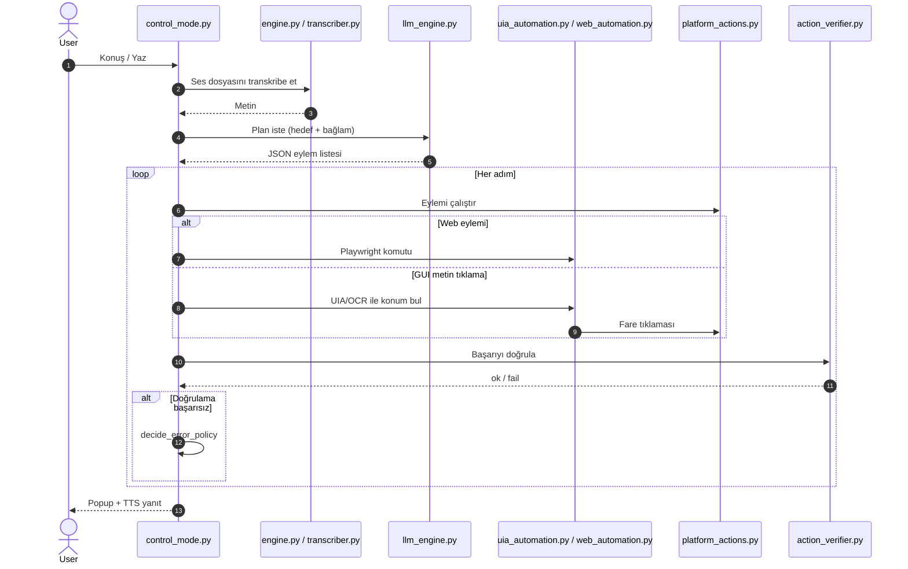

# DictaDesk

**DictaDesk**, Windows için geliştirilmiş, Türkçe ve İngilizce destekleyen sesli (ve metin tabanlı) masaüstü otomasyon asistanıdır. Mikrofon veya klavye ile verdiğiniz komutları anlar, yapılandırılmış eylem planına dönüştürür ve bilgisayarınızda uygular.

> Sesli PC kontrolü — uygulama açma, dosya işlemleri, tarayıcı otomasyonu, ses/parlaklık ayarı, GUI tıklama ve daha fazlası.

---

## İçindekiler

- [Özellikler](#özellikler)
- [Gereksinimler](#gereksinimler)
- [Kurulum](#kurulum)
- [Hızlı Başlangıç](#hızlı-başlangıç)
- [Gerekli AI Modelleri](#gerekli-ai-modelleri)
- [Yapılandırma](#yapılandırma)
- [Proje Mimarisi](#proje-mimarisi)
- [Veri Akışı](#veri-akışı)
- [Güvenlik ve Gizlilik](#güvenlik-ve-gizlilik)
- [Klasör Yapısı](#klasör-yapısı)
- [Sorun Giderme](#sorun-giderme)
- [Lisanslar](#lisanslar)

---

## Özellikler

| Alan | Açıklama |
|------|----------|
| **STT** | Konuşmayı metne çevirir — yerel Whisper, Vosk veya Groq API |
| **LLM Planlayıcı** | Komutu JSON eylem listesine dönüştürür — yerel Phi-3.5 GGUF veya Groq API |
| **VLM** | Ekran görüntüsü analizi ile GUI koordinasyonu — Groq API |
| **TTS** | Sesli geri bildirim — Piper (yerel) veya ElevenLabs API |
| **GUI Otomasyon** | Windows UIA, OCR (Tesseract), PyAutoGUI ile tıklama/yazma |
| **Web Otomasyon** | Playwright ile arama, form doldurma, sayfa etkileşimi |
| **Özel Komutlar** | `commands.json` ile Türkçe/İngilizce kalıp eşleştirme |
| **Güvenlik Katmanı** | Tehlikeli eylemler için onay; `actions_manifest.json` güvenlik seviyeleri |
| **Hafıza** | Uzun vadeli tercih ve not saklama (`memory/long_term.json`) |

---

## Gereksinimler

### Sistem

- **İşletim sistemi:** Windows 10/11 (64-bit)
- **Python:** 3.12 (`runtime.txt`)
- **Mikrofon:** Sesli komut için
- **İnternet:** API modları ve Whisper model indirmesi için (yerel modlarda kısmen opsiyonel)

### Harici yazılımlar

| Yazılım | Zorunlu mu? | Amaç |
|---------|-------------|------|
| [Tesseract OCR](https://github.com/tesseract-ocr/tesseract) | GUI metin tıklama için önerilir | Ekrandaki yazıyı okuma |
| [Playwright Chromium](https://playwright.dev/) | Web otomasyonu için | `playwright install chromium` |
| Piper (opsiyonel) | Yerel TTS | `pip install piper-tts` veya ayrı `piper.exe` |

---

## Kurulum

```powershell
# 1. Depoyu klonlayın
git clone https://github.com/KULLANICI/DictaDesk.git
cd DictaDesk

# 2. Sanal ortam (önerilir)
python -m venv .venv
.\.venv\Scripts\Activate.ps1

# 3. Bağımlılıklar
pip install -r requirements.txt
pip install -r requirements-optional.txt   # yerel LLM istiyorsanız

# 4. Playwright tarayıcısı
playwright install chromium

# 5. API anahtarları (bulut modları için)
copy secrets.json.example secrets.json
# secrets.json dosyasını düzenleyin — ASLA Git'e eklemeyin

# 6. Hafıza dosyası (opsiyonel — yoksa otomatik oluşur)
copy memory\long_term.json.example memory\long_term.json

# 7. AI modelleri — bkz. "Gerekli AI Modelleri" bölümü
```

DictaDesk'i başlatın:

```powershell
python voice_control.py
# veya
python main.py
```

---

## Hızlı Başlangıç

1. Arayüz dilini seçin (`tr` / `en`).
2. STT motorunu seçin (Whisper yerel, Vosk yerel veya Groq API).
3. TTS, LLM ve VLM sağlayıcılarını yapılandırın.
4. **Sistem kontrol modu**na girin.
5. **Ctrl+Shift+6** ile kayıt alın; komutunuzu söyleyin, tekrar bırakın.
6. Alternatif: mod açıkken satır satır metin komutu yazın.

Ana menü seçenekleri:

| # | Mod |
|---|-----|
| 1 | Sistem kontrol modu (canlı ses + metin) |
| 2 | Test modu (`test_sounds/` dosyalarını transkribe eder) |
| 3 | Self-check (bağımlılık ve klasör kontrolü) |
| 4 | Komut yöneticisi |
| 5 | Ayarlar (TTS/LLM/VLM/GUI/Web aç-kapa, hafıza) |
| 6 | Çıkış |

---

## Gerekli AI Modelleri

DictaDesk esnek bir mimari kullanır: **her katman için yerel veya bulut** seçebilirsiniz.
Minimum kurulumda yalnızca **Whisper (faster-whisper)** otomatik indirilir; diğerleri isteğe bağlıdır.

### Konuşma tanıma (STT)

| Seçenek | Model | Boyut (yaklaşık) | Kurulum |
|---------|-------|------------------|---------|
| **Whisper (önerilen, yerel)** | `small` (config: `LOCAL_MODEL_SIZE`) | ~500 MB (ilk çalıştırmada indirilir) | Ek adım gerekmez |
| **Vosk TR** | `vosk-model-small-tr-0.3` | ~40 MB | `vosk_models/MODELS_README.txt` |
| **Vosk EN** | `vosk-model-small-en-us-0.15` | ~40 MB | `vosk_models/MODELS_README.txt` |
| **Groq API** | `whisper-large-v3-turbo` | — | `secrets.json` → `stt.groq` |

### Komut planlayıcı (LLM)

| Seçenek | Model | Boyut | Kurulum |
|---------|-------|-------|---------|
| **Yerel** | Phi-3.5-mini-instruct GGUF (Q4_K_M) | ~2–4 GB | `llm_models/MODELS_README.txt` + `llama-cpp-python` |
| **Groq API (önerilen)** | `meta-llama/llama-4-scout-17b-16e-instruct` veya `openai/gpt-oss-120b` | — | `secrets.json` → `llm.groq` |

### Görsel analiz (VLM)

| Seçenek | Model | Kurulum |
|---------|-------|---------|
| **Groq API** | `meta-llama/llama-4-scout-17b-16e-instruct` | `secrets.json` → `vlm.groq` |

VLM, ekranda tıklanacak öğe bulunması gereken komutlarda devreye girer.

### Metin okuma (TTS)

| Seçenek | Model | Kurulum |
|---------|-------|---------|
| **Piper (yerel)** | `en_US-joe-medium` (.onnx + .json) | `tts_models/MODELS_README.txt` |
| **ElevenLabs API** | Kullanıcı tanımlı ses | `secrets.json` → `tts.elevenlabs` |
| **Kapalı** | — | Menüden TTS kapatılabilir |

### Önerilen profiller

| Profil | STT | LLM | VLM | TTS | İnternet |
|--------|-----|-----|-----|-----|----------|
| **Tamamen çevrimdışı** | Whisper veya Vosk | Phi-3.5 GGUF | — (OCR/UIA ile sınırlı) | Piper | Gerekmez |
| **Dengeli (önerilen)** | Whisper yerel | Groq API | Groq API | Piper veya kapalı | LLM/VLM için |
| **Tam bulut** | Groq Whisper | Groq LLM | Groq VLM | ElevenLabs | Gerekli |

> **Önemli:** `llm_models/`, `vosk_models/` ve `tts_models/` içindeki ağırlık dosyaları GitHub'a **yüklenmez**. Her klasördeki `MODELS_README.txt` dosyasını okuyun.

---

## Yapılandırma

### `secrets.json` (Git'e eklenmez)

```json
{
  "stt": { "groq": { "api_key": "...", "model": "whisper-large-v3-turbo" } },
  "tts": { "elevenlabs": { "api_key": "...", "voice_id": "...", "model": "..." } },
  "llm": { "groq": { "api_key": "...", "model": "meta-llama/llama-4-scout-17b-16e-instruct" } },
  "vlm": { "groq": { "api_key": "...", "model": "meta-llama/llama-4-scout-17b-16e-instruct" } }
}
```

Şablon: `secrets.json.example` — kopyalayıp kendi anahtarlarınızı girin.

### Sağlayıcı şemaları

| Dosya | Açıklama |
|-------|----------|
| `providers.json` | STT API uç noktaları |
| `llm_providers.json` | LLM API uç noktaları |
| `vlm_providers.json` | VLM API uç noktaları |
| `tts_providers.json` | TTS API uç noktaları |

### `config.py`

Merkezi ayarlar: model boyutları, VAD eşikleri, OCR dilleri, uygulama takma adları (`APP_ALIASES`), otomasyon zaman aşımları, popup süresi.

### `commands.json`

Türkçe ve İngilizce özel ses komutları (ifade → eylem eşlemesi). Komut yöneticisi menüsünden düzenlenebilir.

### `actions_manifest.json`

Tüm yürütülebilir eylemler, parametreleri, güvenlik seviyeleri (`safe`, `needs_confirmation`, `dangerous`) ve doğrulama türleri.

---

## Proje Mimarisi

DictaDesk katmanlı bir boru hattı (pipeline) kullanır:

```
Kullanıcı (ses / metin)
        │
        ▼
┌───────────────────┐
│  Girdi Katmanı    │  audio_io.py — kayıt, VAD (ses algılama)
│  Ctrl+Shift+6     │  control_mode.py — hotkey, metin kuyruğu
└─────────┬─────────┘
          ▼
┌───────────────────┐
│  STT              │  engine.py → SwitchableTranscriber
│                   │  transcriber.py — Whisper / Vosk / HTTP API
└─────────┬─────────┘
          ▼
┌───────────────────┐
│  Yönlendirme      │  commands_manager.py — özel kalıp eşleştirme
│                   │  control_mode.py — sezgisel ayrıştırıcılar
│                   │  llm_engine.py — LLM planlayıcı (JSON eylemler)
└─────────┬─────────┘
          ▼
┌───────────────────┐
│  Bağlam           │  agent_memory.py — uzun vadeli hafıza
│                   │  UIA özet + açık pencereler + sistem istatistikleri
│                   │  vlm_engine.py — ekran görüntüsü analizi (gerekirse)
└─────────┬─────────┘
          ▼
┌───────────────────┐
│  Yürütme          │  platform_actions.py — OS otomasyonu
│                   │  uia_automation.py — Windows UIA ağacı
│                   │  web_automation.py — Playwright
└─────────┬─────────┘
          ▼
┌───────────────────┐
│  Doğrulama        │  action_verifier.py — eylem başarı kontrolü
│  Hata politikası  │  agent_error_policy.py — skip/retry/replan/abort
└─────────┬─────────┘
          ▼
┌───────────────────┐
│  Çıktı            │  ui_popup.py — ekran bildirimi
│                   │  tts_engine.py — sesli yanıt
└───────────────────┘
```

### Çekirdek modüller

#### Giriş noktaları

| Modül | Görev |
|-------|-------|
| `main.py` | Ana menü, ayarlar, mod seçimi |
| `voice_control.py` | `main()` için ince sarmalayıcı |
| `control_mode.py` | `ControlSession` — sonsuz kontrol döngüsü, iş kuyruğu, planlama |

#### Ses işleme

| Modül | Görev |
|-------|-------|
| `audio_io.py` | Mikrofon kaydı, RMS tabanlı VAD, `.wav` kaydetme |
| `transcriber.py` | `LocalTranscriber`, `VoskTranscriber`, `HttpApiTranscriber` |
| `engine.py` | `SwitchableTranscriber` — birincil/fallback STT seçimi |
| `tts_engine.py` | Piper yerel TTS ve API TTS (`TTSManager`) |

#### Yapay zeka

| Modül | Görev |
|-------|-------|
| `llm_engine.py` | Sistem/kullanıcı promptları, JSON eylem ayrıştırma, yeniden planlama |
| `vlm_engine.py` | Ekran görüntüsü base64, VLM API, koordinat çıkarımı |
| `secrets_store.py` | `secrets.json` okuma/yazma (`get_entry`, `set_entry`) |
| `agent_memory.py` | `memory/long_term.json` — kimlik, tercihler, rutinler |
| `actions_manifest.py` | `actions_manifest.json` yükleyici ve LLM prompt özeti |

#### Otomasyon

| Modül | Görev |
|-------|-------|
| `platform_actions.py` | Uygulama başlatma, hotkey, dosya işlemleri, ses/parlaklık, OCR/GUI tıklama |
| `uia_automation.py` | Windows UI Automation — erişilebilirlik ağacı, metin bulma |
| `web_automation.py` | Playwright — arama, tıklama, form, captcha algılama |
| `action_verifier.py` | Pencere açık mı, odakta mı, dosya var mı doğrulama |

#### Destek

| Modül | Görev |
|-------|-------|
| `i18n.py` | Türkçe/İngilizce UI metinleri |
| `commands_manager.py` | `commands.json` CRUD ve `match_command()` |
| `providers.py` | STT sağlayıcı şema doğrulama |
| `automation_settings.py` | GUI/Web otomasyon aç-kapa |
| `agent_queue.py` | Arka planda eylem iş kuyruğu |
| `agent_error_policy.py` | `decide_error_policy()` — hata sonrası karar |
| `utils.py` | Türkçe karakter katlama, metin normalizasyonu |
| `ui_popup.py` | Tkinter durum popup'ları |
| `self_check.py` | Kurulum tanı diagnostiği |
| `debug_replay.py` | Hata ayıklama JSON dökümleri |
| `test.py` | Test modu |

### ControlSession — çalışma zamanı çekirdeği

`control_mode.py` içindeki `ControlSession` sınıfı tüm oturumu yönetir:

- **Hotkey:** `Ctrl+Shift+6` ile kayıt başlat/durdur
- **Metin girişi:** Aynı döngüde stdin satırları kabul eder
- **AgentQueue:** Eylemleri arka plan iş parçacığında çalıştırır
- **Bağlam oluşturma:** `_build_state_context()` — açık pencereler, CPU/RAM, UIA özeti
- **Görsel bağlam:** GUI komutlarında OCR haritası + isteğe bağlı VLM
- **Onay kapıları:** Tehlikeli eylemler için kullanıcı onayı

### Komut yönlendirme önceliği

1. **Özel komut eşleşmesi** — `commands.json` kalıpları
2. **Sezgisel ayrıştırıcılar** — ses seviyesi, parlaklık, kaydırma, tarayıcı algılama
3. **LLM planlayıcı** — doğal dil → JSON eylem dizisi
4. **Hata politikası** — doğrulama başarısızsa `skip` / `retry` / `replan` / `abort`

### Güvenlik modeli

`actions_manifest.json` her eyleme bir `safety` etiketi atar:

| Seviye | Davranış |
|--------|----------|
| `safe` | Doğrudan çalıştırılır |
| `needs_confirmation` | Kullanıcı onayı istenir |
| `dangerous` | Kapatma, silme, shell komutu vb. — onay zorunlu |

`OPEN_BLOCKLIST` (`config.py`) riskli hedefleri engeller.

### Tasarım kalıpları

- **Fallback dayanıklılığı:** STT ve LLM API hatalarında yerel modele düşüş
- **Doğrulama sonrası eylem:** `action_verifier.py` ile pencere/odak/dosya kontrolü
- **Bulanık eşleştirme:** `utils.fold_text()` — "çıkış" ↔ "cikis"
- **DPI farkındalığı:** `platform_actions.py` Windows ölçekleme ve pencere sınırları

---

## Veri Akışı



---

## Güvenlik ve Gizlilik

**Asla Git'e eklemeyin:**

| Dosya / klasör | Neden |
|----------------|-------|
| `secrets.json` | API anahtarları |
| `memory/long_term.json` | Kişisel tercihler ve notlar |
| `recordings/`, `transcripts/` | Ses kayıtları ve transkriptler |
| `llm_models/*.gguf` | Büyük model ağırlıkları |
| `vosk_models/**` | Vosk model dosyaları |
| `tts_models/**/*.onnx` | Piper ses modelleri |

`.gitignore` bu dosyaları otomatik hariç tutar. Dağıtım öncesi `git status` ile kontrol edin.

API anahtarları yalnızca `secrets_store.py` üzerinden okunur; kod içinde sabit anahtar bulunmaz.

---

## Klasör Yapısı

```
DictaDesk/
├── main.py                 # Ana giriş
├── voice_control.py        # Alternatif giriş
├── control_mode.py         # Kontrol döngüsü (ControlSession)
├── config.py               # Merkezi yapılandırma
├── secrets.json.example    # API şablonu (kopyala → secrets.json)
├── requirements.txt
├── requirements-optional.txt
├── README.md
├── THIRD_PARTY.md
├── .gitignore
│
├── llm_models/
│   └── MODELS_README.txt   # GGUF indirme talimatları
├── vosk_models/
│   └── MODELS_README.txt   # Vosk indirme talimatları
├── tts_models/
│   └── MODELS_README.txt   # Piper indirme talimatları
│
├── memory/
│   ├── README.txt
│   └── long_term.json.example
├── recordings/             # README.txt (içerik Git'e gitmez)
├── transcripts/
├── screenshots/
├── tts_outputs/
├── debug_replays/
├── mappedscreenshots/
└── test_sounds/
```

---

## Sorun Giderme

| Sorun | Çözüm |
|-------|-------|
| Mikrofon çalışmıyor | Self-check (menü 3); `sounddevice` sürücüleri |
| Vosk modeli bulunamadı | `vosk_models/MODELS_README.txt` adımlarını izleyin |
| OCR / metin tıklama yok | Tesseract kurun; `config.TESSERACT_CMD` yolunu ayarlayın |
| Web otomasyonu hata veriyor | `playwright install chromium` |
| Yerel LLM başlamıyor | `pip install llama-cpp-python` + GGUF dosyası `llm_models/` |
| API hatası | `secrets.json` anahtarlarını kontrol edin; ağ bağlantısı |
| Whisper ilk seferde yavaş | Model indiriliyor; sabırlı olun veya Vosk deneyin |

---

## Lisanslar

Uygulama kaynak kodu ve üçüncü taraf kütüphane lisansları için **[THIRD_PARTY.md](THIRD_PARTY.md)** dosyasına bakın.

AI model lisansları (Phi-3.5, Vosk, Whisper, Piper sesleri, Groq/ElevenLabs ToS) modele ve sağlayıcıya göre değişir; ticari kullanımda ilgili lisans metinlerini okuyun.

---

## Katkı

Issue ve pull request'ler memnuniyetle karşılanır. API anahtarı veya model ağırlığı içeren commit'ler kabul edilmez.

---

**DictaDesk** — Windows'ta sesinizle bilgisayarınızı yönetin.
