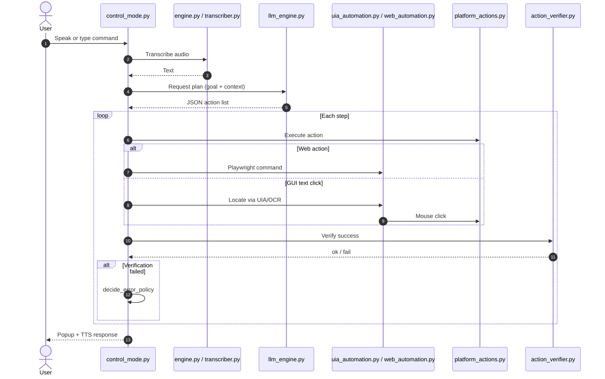

# DictaDesk

**DictaDesk** is a Windows voice and text automation assistant. It accepts spoken or typed commands in **Turkish** and **English**, plans structured actions with an LLM, and executes them on your desktop — launching apps, managing files, controlling volume/brightness, automating browsers, and clicking GUI elements.

---

## Table of Contents

- [Features](#features)
- [Requirements](#requirements)
- [Installation](#installation)
- [Quick Start](#quick-start)
- [AI Models](#ai-models)
- [Configuration](#configuration)
- [Architecture](#architecture)
- [Data Flow](#data-flow)
- [Security & Privacy](#security--privacy)
- [Project Layout](#project-layout)
- [Troubleshooting](#troubleshooting)
- [Licenses](#licenses)

---

## Features

| Layer | Description |
|-------|-------------|
| **STT** | Speech-to-text via local Whisper, local Vosk, or Groq API |
| **LLM planner** | Natural language → JSON action plan (local Phi-3.5 GGUF or Groq API) |
| **VLM** | Screenshot analysis for GUI targeting (Groq API) |
| **TTS** | Spoken feedback via Piper (local) or ElevenLabs API |
| **GUI automation** | Windows UIA, Tesseract OCR, PyAutoGUI |
| **Web automation** | Playwright — search, forms, page interaction |
| **Custom commands** | Phrase mapping in `commands.json` (TR/EN) |
| **Safety gates** | Confirmation for dangerous actions (`actions_manifest.json`) |
| **Memory** | Long-term preferences and notes (`memory/long_term.json`) |

---

## Requirements

### System

- **OS:** Windows 10/11 (64-bit) — required
- **Python:** 3.12 (see `runtime.txt`)
- **Microphone:** for voice commands
- **Internet:** required for API modes; optional for fully local setup

### External tools

| Tool | Required? | Purpose |
|------|-----------|---------|
| [Tesseract OCR](https://github.com/tesseract-ocr/tesseract) | Recommended | Screen text recognition |
| [Playwright Chromium](https://playwright.dev/) | For web automation | `playwright install chromium` |
| Piper | Optional | Local TTS (`pip install piper-tts`) |

---

## Installation

```powershell
git clone https://github.com/YOUR_USERNAME/DictaDesk.git
cd DictaDesk

python -m venv .venv
.\.venv\Scripts\Activate.ps1

pip install -r requirements.txt
pip install -r requirements-optional.txt   # only if using local LLM

playwright install chromium

copy secrets.json.example secrets.json
# Edit secrets.json with your API keys — never commit this file

copy memory\long_term.json.example memory\long_term.json
# Optional — DictaDesk creates this automatically if missing
```

Download AI models as described in [AI Models](#ai-models) below.

Start DictaDesk:

```powershell
python voice_control.py
# or
python main.py
```

---

## Quick Start

1. Choose UI language (`tr` / `en`).
2. Select STT engine (local Whisper, local Vosk, or Groq API).
3. Configure TTS, LLM, and VLM providers.
4. Enter **Control mode**.
5. Press **Ctrl+Shift+6** to start/stop recording; speak your command.
6. Alternatively, type commands line-by-line while control mode is active.

Main menu:

| # | Mode |
|---|------|
| 1 | Control mode (live voice + text) |
| 2 | Test mode (transcribe files from `test_sounds/`) |
| 3 | Self-check (dependency and folder diagnostics) |
| 4 | Command manager |
| 5 | Settings (TTS/LLM/VLM/GUI/Web toggles, memory) |
| 6 | Exit |

---

## AI Models

DictaDesk supports **local or cloud** for each layer. Only **Whisper (faster-whisper)** auto-downloads on first run; everything else is optional.

### Speech-to-text (STT)

| Option | Model | Size (approx.) | Setup |
|--------|-------|----------------|-------|
| **Whisper (recommended, local)** | `small` (`LOCAL_MODEL_SIZE` in `config.py`) | ~500 MB (downloaded on first run) | No extra steps |
| **Vosk TR** | `vosk-model-small-tr-0.3` | ~40 MB | See `vosk_models/MODELS_README.txt` |
| **Vosk EN** | `vosk-model-small-en-us-0.15` | ~40 MB | See `vosk_models/MODELS_README.txt` |
| **Groq API** | `whisper-large-v3-turbo` | — | `secrets.json` → `stt.groq` |

### Command planner (LLM)

| Option | Model | Size | Setup |
|--------|-------|------|-------|
| **Local** | Phi-3.5-mini-instruct GGUF (Q4_K_M) | ~2–4 GB | See `llm_models/MODELS_README.txt` + `llama-cpp-python` |
| **Groq API (recommended)** | `meta-llama/llama-4-scout-17b-16e-instruct` or `openai/gpt-oss-120b` | — | `secrets.json` → `llm.groq` |

### Vision (VLM)

| Option | Model | Setup |
|--------|-------|-------|
| **Groq API** | `meta-llama/llama-4-scout-17b-16e-instruct` | `secrets.json` → `vlm.groq` |

VLM activates when the command requires finding on-screen elements to click.

### Text-to-speech (TTS)

| Option | Model | Setup |
|--------|-------|-------|
| **Piper (local)** | `en_US-joe-medium` (`.onnx` + `.json`) | See `tts_models/MODELS_README.txt` |
| **ElevenLabs API** | User-defined voice | `secrets.json` → `tts.elevenlabs` |
| **Off** | — | Disable in menu |

### Recommended profiles

| Profile | STT | LLM | VLM | TTS | Internet |
|---------|-----|-----|-----|-----|----------|
| **Fully offline** | Whisper or Vosk | Phi-3.5 GGUF | — (OCR/UIA only) | Piper | Not required |
| **Balanced** | Local Whisper | Groq API | Groq API | Piper or off | For LLM/VLM |
| **Full cloud** | Groq Whisper | Groq LLM | Groq VLM | ElevenLabs | Required |

> **Important:** Model weight files under `llm_models/`, `vosk_models/`, and `tts_models/` are **not** included in this repository. Read each folder's `MODELS_README.txt` for download instructions.

---

## Configuration

### `secrets.json` (never commit)

```json
{
  "stt": { "groq": { "api_key": "...", "model": "whisper-large-v3-turbo" } },
  "tts": { "elevenlabs": { "api_key": "...", "voice_id": "...", "model": "..." } },
  "llm": { "groq": { "api_key": "...", "model": "meta-llama/llama-4-scout-17b-16e-instruct" } },
  "vlm": { "groq": { "api_key": "...", "model": "meta-llama/llama-4-scout-17b-16e-instruct" } }
}
```

Copy from `secrets.json.example` and fill in your own keys.

### Provider schemas

| File | Purpose |
|------|---------|
| `providers.json` | STT API endpoints |
| `llm_providers.json` | LLM API endpoints |
| `vlm_providers.json` | VLM API endpoints |
| `tts_providers.json` | TTS API endpoints |

### Other config files

| File | Purpose |
|------|---------|
| `config.py` | Paths, model defaults, VAD, OCR, app aliases, timeouts |
| `commands.json` | Custom voice command phrase → action mappings |
| `actions_manifest.json` | All executable actions, safety levels, verification types |

---

## Architecture

DictaDesk uses a layered pipeline:

```
User (voice / text)
        │
        ▶
┌───────────────────┐
│  Input            │  audio_io.py — recording, VAD
│  Ctrl+Shift+6     │  control_mode.py — hotkey, text queue
└─────────┬─────────┘
          ▼
┌───────────────────┐
│  STT              │  engine.py → SwitchableTranscriber
│                   │  transcriber.py — Whisper / Vosk / HTTP API
└─────────┬─────────┘
          ▼
┌───────────────────┐
│  Routing          │  commands_manager.py — custom phrase match
│                   │  control_mode.py — heuristic parsers
│                   │  llm_engine.py — LLM planner (JSON actions)
└─────────┬─────────┘
          ▼
┌───────────────────┐
│  Context          │  agent_memory.py — long-term memory
│                   │  Open windows + system stats + UIA summary
│                   │  vlm_engine.py — screenshot analysis (if needed)
└─────────┬─────────┘
          ▼
┌───────────────────┐
│  Execution        │  platform_actions.py — OS automation
│                   │  uia_automation.py — Windows UIA tree
│                   │  web_automation.py — Playwright
└─────────┬─────────┘
          ▼
┌───────────────────┐
│  Verification     │  action_verifier.py — success checks
│  Error policy     │  agent_error_policy.py — skip/retry/replan/abort
└─────────┬─────────┘
          ▼
┌───────────────────┐
│  Output           │  ui_popup.py — on-screen status
│                   │  tts_engine.py — spoken response
└───────────────────┘
```

### Core modules

#### Entry points

| Module | Role |
|--------|------|
| `main.py` | Main menu, settings, mode selection |
| `voice_control.py` | Thin wrapper around `main()` |
| `control_mode.py` | `ControlSession` — control loop, job queue, planning |

#### Audio

| Module | Role |
|--------|------|
| `audio_io.py` | Microphone recording, RMS-based VAD, `.wav` output |
| `transcriber.py` | `LocalTranscriber`, `VoskTranscriber`, `HttpApiTranscriber` |
| `engine.py` | `SwitchableTranscriber` — primary/fallback STT selection |
| `tts_engine.py` | Piper local TTS and API TTS (`TTSManager`) |

#### AI engines

| Module | Role |
|--------|------|
| `llm_engine.py` | Prompts, JSON action parsing, replanning on failure |
| `vlm_engine.py` | Screenshot encoding, VLM API, coordinate extraction |
| `secrets_store.py` | Read/write `secrets.json` (`get_entry`, `set_entry`) |
| `agent_memory.py` | `memory/long_term.json` — identity, preferences, routines |
| `actions_manifest.py` | Loads `actions_manifest.json` for LLM prompts |

#### Automation

| Module | Role |
|--------|------|
| `platform_actions.py` | App launch, hotkeys, files, volume/brightness, OCR/GUI clicks |
| `uia_automation.py` | Windows UI Automation — accessibility tree, text lookup |
| `web_automation.py` | Playwright — search, click, forms, captcha detection |
| `action_verifier.py` | Verify window open, focus, file exists, web action success |

#### Support

| Module | Role |
|--------|------|
| `i18n.py` | Turkish/English UI strings |
| `commands_manager.py` | `commands.json` CRUD and `match_command()` |
| `providers.py` | STT provider schema validation |
| `automation_settings.py` | GUI/Web automation toggles |
| `agent_queue.py` | Background action job queue |
| `agent_error_policy.py` | `decide_error_policy()` after failures |
| `utils.py` | Turkish character folding, text normalization |
| `ui_popup.py` | Tkinter status popups |
| `self_check.py` | Setup diagnostics |
| `debug_replay.py` | Debug JSON dumps |
| `test.py` | Test mode |

### ControlSession runtime

The `ControlSession` class in `control_mode.py` manages the live session:

- **Hotkey:** `Ctrl+Shift+6` toggles recording
- **Text input:** accepts stdin lines in the same loop
- **AgentQueue:** runs actions on a background worker thread
- **Context:** `_build_state_context()` — open windows, CPU/RAM, UIA summary
- **Visual context:** OCR map + optional VLM for GUI commands
- **Confirmation gates:** user approval for dangerous actions

### Command routing priority

1. **Custom command match** — `commands.json` phrases
2. **Heuristic parsers** — volume, brightness, scroll, browser detection
3. **LLM planner** — natural language → JSON action array
4. **Error policy** — on verification failure: `skip` / `retry` / `replan` / `abort`

### Safety model

| Level | Behavior |
|-------|----------|
| `safe` | Executed directly |
| `needs_confirmation` | User confirmation required |
| `dangerous` | Shutdown, delete, shell commands — confirmation required |

`OPEN_BLOCKLIST` in `config.py` blocks risky open/start targets.

### Design patterns

- **Fallback resilience:** STT/LLM API failures fall back to local models
- **Post-action verification:** `action_verifier.py` checks window/focus/file state
- **Fuzzy matching:** `utils.fold_text()` — e.g. `"çıkış"` matches `"cikis"`
- **DPI awareness:** `platform_actions.py` handles Windows scaling and window bounds

---

## Data Flow



---

## Security & Privacy

### Never commit these files

| Path | Reason |
|------|--------|
| `secrets.json` | API keys |
| `memory/long_term.json` | Personal preferences and notes |
| `recordings/`, `transcripts/` | Audio recordings and transcripts |
| `llm_models/*.gguf` | Large model weights |
| `vosk_models/**` | Vosk model files |
| `tts_models/**/*.onnx` | Piper voice models |

`.gitignore` excludes all of the above. Before pushing, run:

```powershell
git status
git check-ignore -v secrets.json memory/long_term.json
```

See [SECURITY.md](SECURITY.md) for a full pre-push checklist.

API keys are loaded only through `secrets_store.py` — no hardcoded credentials in source code.

---

## Project Layout

```
DictaDesk/
├── main.py
├── voice_control.py
├── control_mode.py
├── config.py
├── secrets.json.example
├── requirements.txt
├── requirements-optional.txt
├── README.md
├── THIRD_PARTY.md
├── SECURITY.md
├── .gitignore
│
├── llm_models/MODELS_README.txt
├── vosk_models/MODELS_README.txt
├── tts_models/MODELS_README.txt
│
├── memory/
│   ├── README.txt
│   └── long_term.json.example
├── recordings/          README.txt only (content gitignored)
├── transcripts/
├── screenshots/
├── tts_outputs/
├── debug_replays/
├── mappedscreenshots/
└── test_sounds/
```

---

## Troubleshooting

| Issue | Fix |
|-------|-----|
| Microphone not working | Run self-check (menu 3); verify `sounddevice` drivers |
| Vosk model not found | Follow `vosk_models/MODELS_README.txt` |
| OCR / text click fails | Install Tesseract; set `TESSERACT_CMD` in `config.py` |
| Web automation errors | Run `playwright install chromium` |
| Local LLM won't start | `pip install llama-cpp-python` + place GGUF in `llm_models/` |
| API errors | Check `secrets.json` keys and network connection |
| Whisper slow on first run | Model is downloading; wait or try Vosk |

---

## Licenses

Third-party library licenses: **[THIRD_PARTY.md](THIRD_PARTY.md)**

AI model licenses (Phi-3.5, Vosk, Whisper, Piper voices, Groq/ElevenLabs ToS) vary by model and provider — review before commercial use.

Project source: see [LICENSE](LICENSE).

---

**DictaDesk** — control your PC with your voice on Windows.
